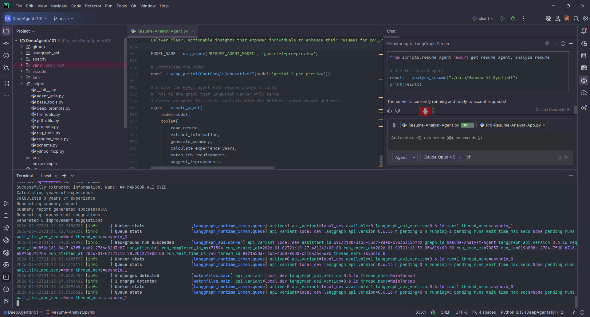
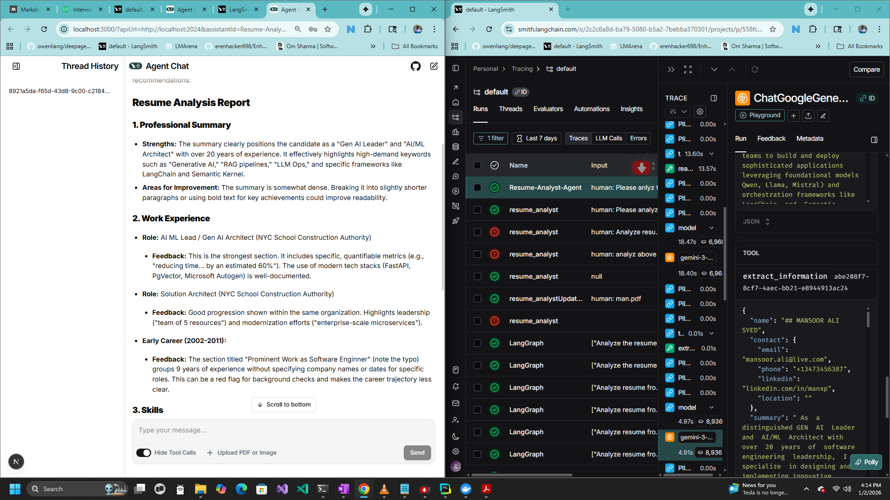

# 📄 Pro Resume Analyst Agent

An AI-powered Resume Analysis Agent built with LangGraph and Google Gemini that provides comprehensive resume evaluation, skill extraction, job matching, and improvement suggestions.



## 🌟 Features

- **📖 Resume Parsing**: Read and parse resumes from PDF, DOCX, and other document formats using Docling
- **👤 Information Extraction**: Automatically extract name, contact info, experience, skills, education, and certifications
- **📊 Summary Generation**: Generate comprehensive analysis reports with key insights
- **📅 Experience Calculation**: Calculate total years of professional experience
- **🎯 Job Matching**: Match resume skills against job requirements with match percentage
- **💡 Improvement Suggestions**: Get actionable recommendations to enhance your resume
- **🔒 PII Protection**: Built-in middleware for redacting sensitive information (emails, credit cards, URLs)
- **🔗 LangGraph Server**: Expose the agent as an HTTP API for easy integration

## 🏗️ Architecture

```
┌─────────────────────────────────────────────────────────────┐
│                    Pro Resume Analyst                        │
├─────────────────────────────────────────────────────────────┤
│                                                              │
│  ┌──────────────┐    ┌──────────────┐    ┌──────────────┐  │
│  │   Docling    │    │    Gemini    │    │  LangGraph   │  │
│  │  (Document   │───▶│   (LLM)      │◀───│   Server     │  │
│  │   Parser)    │    │              │    │              │  │
│  └──────────────┘    └──────────────┘    └──────────────┘  │
│                             │                               │
│                             ▼                               │
│  ┌─────────────────────────────────────────────────────┐   │
│  │                   Agent Tools                        │   │
│  ├─────────────────────────────────────────────────────┤   │
│  │  • read_resume          • calculate_experience_years │   │
│  │  • extract_information  • match_job_requirements     │   │
│  │  • generate_summary     • suggest_improvements       │   │
│  └─────────────────────────────────────────────────────┘   │
│                                                              │
└─────────────────────────────────────────────────────────────┘
```

## 📁 Project Structure

```
DeepAgents101/
├── Resume-Analyst-Agent.py    # Main agent implementation
├── graph.py                   # LangGraph server graph definition
├── client.py                  # API client for interacting with the server
├── langgraph.json             # LangGraph server configuration
├── pyproject.toml             # Project dependencies
├── requirements.txt           # Python dependencies
├── .env                       # Environment variables (API keys)
├── scripts/
│   ├── resume_tools.py        # Reusable resume analysis tools
│   ├── resume_agent.py        # Shared agent configuration
│   └── pdf_utils.py           # PDF generation utilities
└── data/
    └── MansoorAliSyed.pdf     # Sample resume for testing
```

## 🚀 Getting Started

### Prerequisites

- Python 3.10+
- Google API Key (for Gemini)

### Installation

1. **Clone the repository**
   ```bash
   git clone https://github.com/yourusername/DeepAgents101.git
   cd DeepAgents101
   ```

2. **Create a virtual environment**
   ```bash
   python -m venv .venv
   .venv\Scripts\activate  # Windows
   # or
   source .venv/bin/activate  # Linux/Mac
   ```

3. **Install dependencies**
   ```bash
   pip install -e . "langgraph-cli[inmem]"
   ```

4. **Set up environment variables**
   
   Create a `.env` file with your API keys:
   ```env
   GOOGLE_API_KEY=your_google_api_key_here
   RESUME_AGENT_MODEL=gemini-2.0-flash
   ```

## 💻 Usage

### Option 1: Run as LangGraph Server (Recommended)

Start the LangGraph development server:

```bash
langgraph dev
```

The server will start at:
- **API**: http://127.0.0.1:2024
- **Studio UI**: https://smith.langchain.com/studio/?baseUrl=http://127.0.0.1:2024
- **API Docs**: http://127.0.0.1:2024/docs

### Option 2: Use the Python Client

```python
import asyncio
from client import analyze_resume_via_api, stream_resume_analysis

# Basic analysis
result = asyncio.run(analyze_resume_via_api("./data/MansoorAliSyed.pdf"))
print(result)

# With job requirements matching
result = asyncio.run(analyze_resume_via_api(
    "./data/MansoorAliSyed.pdf",
    job_requirements="5+ years Python, AWS certification, leadership skills"
))
print(result)
```

### Option 3: Command Line Client

```bash
# Basic analysis
python client.py ./data/MansoorAliSyed.pdf

# With job requirements
python client.py ./data/MansoorAliSyed.pdf -j "Python, AWS, Docker, Kubernetes"

# Stream the response
python client.py ./data/MansoorAliSyed.pdf --stream
```

### Option 4: Direct Agent Usage

```python
from Resume-Analyst-Agent import agent

# Analyze a resume
response = agent.invoke({
    'messages': ["Analyze resume from file: ./data/MansoorAliSyed.pdf"]
})
print(response['messages'][-1].text)
```

## 🛠️ Available Tools

| Tool | Description |
|------|-------------|
| `read_resume` | Read and parse resume files (PDF, DOCX, etc.) using Docling |
| `extract_information` | Extract structured data (name, contact, experience, skills, education) |
| `generate_summary` | Generate a comprehensive analysis report |
| `calculate_experience_years` | Calculate total years of professional experience |
| `match_job_requirements` | Match resume against job requirements with match percentage |
| `suggest_improvements` | Provide actionable suggestions to improve the resume |

## 🔍 Observability

The agent integrates with LangSmith for full observability of agent execution:



Track:
- Agent execution traces
- Tool calls and responses
- Token usage and latency
- Error debugging

## 🔒 Privacy & Security

The agent includes built-in PII protection middleware:

- **Email Redaction**: Automatically redacts email addresses from input
- **Credit Card Masking**: Masks credit card numbers
- **URL Redaction**: Redacts URLs from input

```python
middleware=[
    TodoListMiddleware(),
    PIIMiddleware("email", strategy="redact", apply_to_input=True),
    PIIMiddleware("credit_card", strategy="mask", apply_to_input=True),
    PIIMiddleware("url", strategy="redact", apply_to_input=True)
]
```

## 📡 API Endpoints

When running as a LangGraph server:

| Endpoint | Method | Description |
|----------|--------|-------------|
| `/threads` | POST | Create a new conversation thread |
| `/threads/{thread_id}/runs` | POST | Run the agent with input |
| `/threads/{thread_id}/runs/{run_id}` | GET | Get run status/result |
| `/assistants` | GET | List available assistants |
| `/docs` | GET | OpenAPI documentation |

### Example API Request

```bash
curl -X POST http://127.0.0.1:2024/threads \
  -H "Content-Type: application/json"

curl -X POST http://127.0.0.1:2024/threads/{thread_id}/runs \
  -H "Content-Type: application/json" \
  -d '{
    "assistant_id": "resume_analyst",
    "input": {
      "messages": [{"role": "user", "content": "Analyze resume from file: ./data/resume.pdf"}]
    }
  }'
```

## 🧪 Testing

Run the agent with a sample resume:

```python
from scripts.resume_agent import analyze_resume

result = analyze_resume("./data/MansoorAliSyed.pdf")
print(result)
```

## 📦 Dependencies

- `langgraph` - Agent orchestration framework
- `langchain-google-genai` - Google Gemini integration
- `docling` - Document parsing (PDF, DOCX)
- `python-dotenv` - Environment variable management
- `langgraph-cli` - LangGraph server CLI
- `langgraph-sdk` - LangGraph Python SDK

## 🤝 Contributing

Contributions are welcome! Please feel free to submit a Pull Request.

## 📄 License

This project is licensed under the MIT License - see the [LICENSE](LICENSE) file for details.

## 🙏 Acknowledgments

- [LangChain](https://langchain.com/) for the amazing agent framework
- [LangGraph](https://langchain-ai.github.io/langgraph/) for agent orchestration
- [Google Gemini](https://ai.google.dev/) for the powerful LLM
- [Docling](https://github.com/DS4SD/docling) for document parsing

---

<p align="center">
  Made with ❤️ by <a href="https://github.com/yourusername">Your Name</a>
</p>

